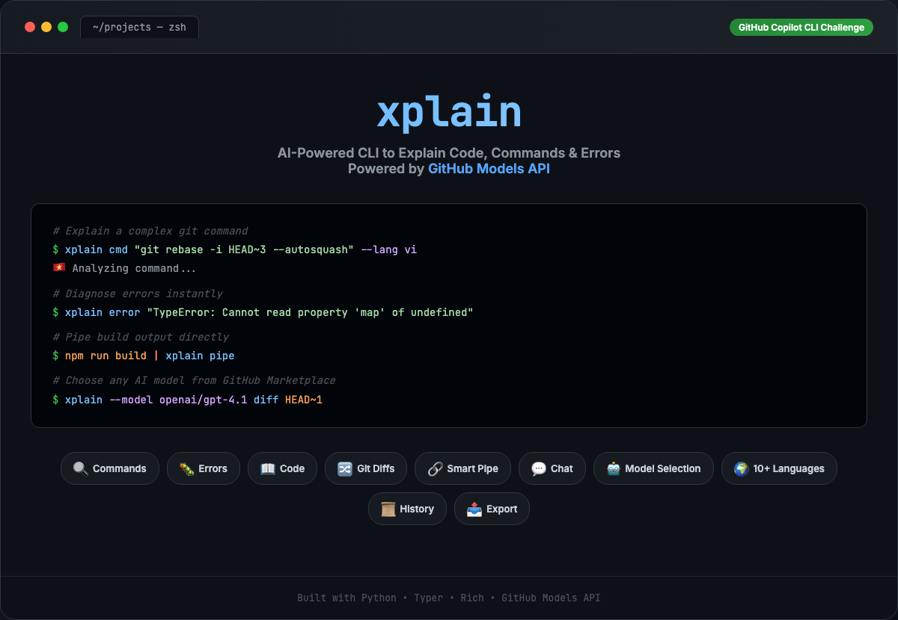
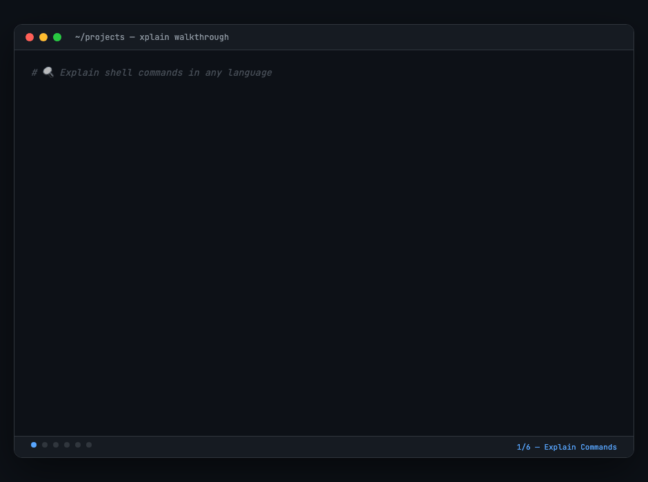
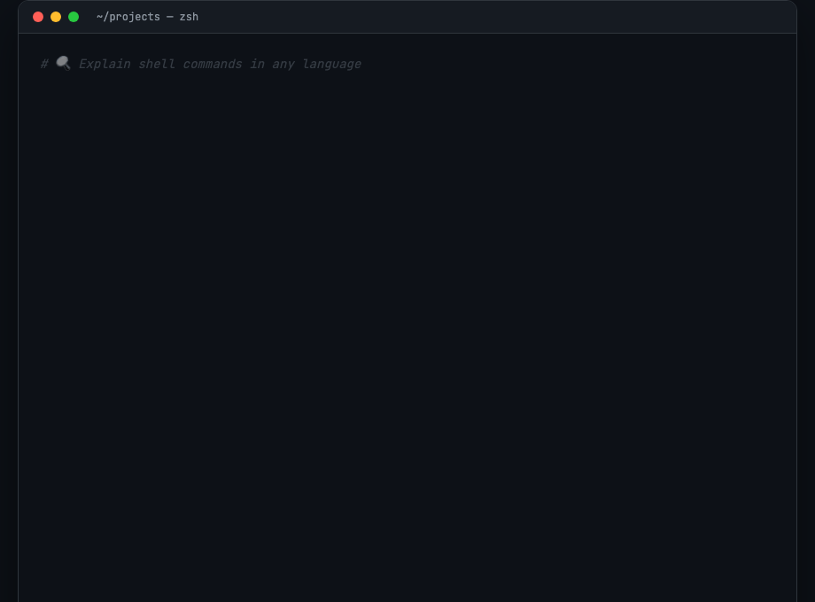
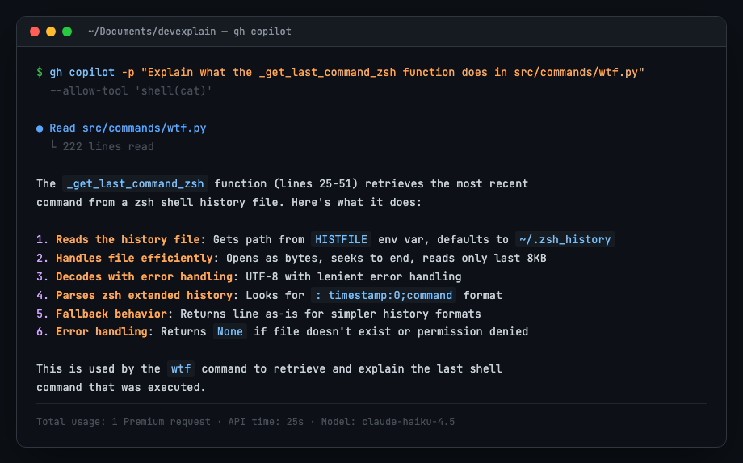
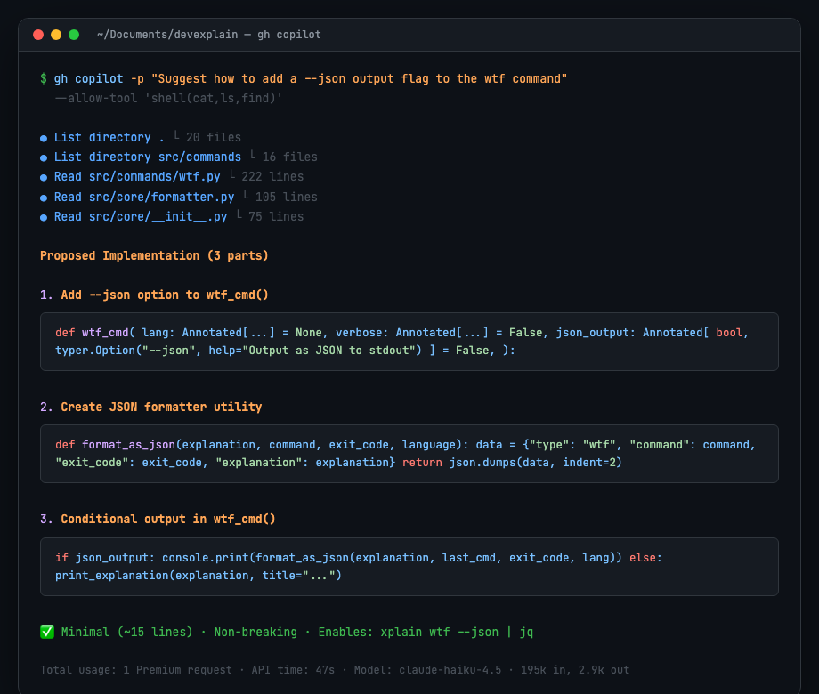

*This is a submission for the [GitHub Copilot CLI Challenge](https://dev.to/challenges/github-2026-01-21)*

## What I Built

**xplain** is a developer-focused CLI tool that uses the GitHub Models API to explain code, shell commands, error messages, and git diffs — in 10+ languages.

As developers, we constantly encounter unfamiliar commands, cryptic errors, and complex diffs. xplain brings AI-powered explanations directly into your terminal workflow:

- **`xplain cmd "git rebase -i HEAD~3 --autosquash"`** — breaks down every flag and argument
- **`xplain error "TypeError: Cannot read property 'map' of undefined"`** — diagnoses the error and suggests fixes
- **`xplain code ./utils.py`** — explains code files step by step
- **`xplain diff HEAD~1`** — summarizes what changed in your last commit
- **`python app.py 2>&1 | xplain pipe`** — auto-detects if piped input is an error, code, or logs
- **`xplain chat`** — interactive chat for any dev question
- **`xplain history`** — browse and search past explanations
- **`xplain wtf`** — 🤯 explain the last failed command from your shell history
- **`xplain --tldr cmd "..."`** — ⚡ one-line TL;DR explanations

All commands support `--lang` for multilingual output (English, Vietnamese, Chinese, Japanese, Korean, Spanish, French, German, Portuguese, Russian), `--model` to choose any AI model from the GitHub Models Marketplace (GPT-4o, GPT-4.1, Llama 4, DeepSeek R1, etc.), and `--output` to export explanations to `.md`, `.json`, or `.txt` files.

### Key Features

- **WTF Mode** — `xplain wtf` reads your shell history, re-runs the last command, captures the error, and explains what went wrong with a fix. Fun, memorable, and solves a real pain point.
- **TL;DR Mode** — `xplain --tldr` for ultra-short one-line explanations across all commands
- **Model Selection** — choose any model from the GitHub Models Marketplace (`--model openai/gpt-4.1`, `--model deepseek/DeepSeek-R1`, etc.)
- **Smart Pipe Detection** — automatically classifies piped input as error, code, or general output using heuristic pattern matching
- **Git Diff Explanations** — understands unstaged, staged, or ref-based diffs with file stats
- **Shell Integration** — `source shell/xplain.zsh` for aliases (`wtf`, `xc`, `xe`, `xd`), tab completion, and auto command-not-found handler
- **Persistent History** — JSON-based local storage of all explanations, searchable and filterable
- **Export** — save any explanation to markdown, JSON, or plain text
- **Beautiful Terminal UI** — Rich-powered panels, syntax highlighting, loading spinners, and language flags

**GitHub Repository:** [github.com/anhfactor/xplain-copilot](https://github.com/anhfactor/xplain-copilot)

## Demo



### Video Walkthrough



The walkthrough covers all 6 core features:
1. **Explain commands** — `xplain cmd "git rebase -i HEAD~3" --lang vi` with Vietnamese output
2. **WTF mode** — `xplain wtf` explains the last failed command with a fix
3. **TL;DR mode** — `xplain --tldr cmd "..."` for one-line answers
4. **Smart pipe** — `npm run build 2>&1 | xplain pipe` auto-detects error output
5. **Model selection** — `xplain --model deepseek/DeepSeek-R1 diff HEAD~1`
6. **Shell integration** — aliases, tab completion, auto command-not-found handler

### Quick Demo



## My Experience with GitHub Copilot CLI

I used [GitHub Copilot CLI](https://gh.io/copilot-cli) (`gh copilot`) throughout the development of xplain. Here are specific examples of how it shaped the project:

### 1. Understanding Code with Copilot CLI

I used `gh copilot` to explain my own code and verify correctness:

```
$ gh copilot -p "Explain what the _get_last_command_zsh function does in src/commands/wtf.py" \
    --allow-tool 'shell(cat)'
```

Copilot CLI read the file autonomously and produced a detailed 6-point breakdown of the function — from how it reads the history file efficiently (last 8KB only) to how it parses zsh's extended history format (`: timestamp:0;command`). This helped me verify the implementation was correct.



### 2. Feature Design with Copilot CLI

I asked Copilot CLI to suggest how to add a `--json` output flag:

```
$ gh copilot -p "Suggest how to add a --json output flag to the wtf command" \
    --allow-tool 'shell(cat,ls,find)'
```

It explored the project structure autonomously (reading 5 files across `src/commands/` and `src/core/`), then produced a 3-part implementation plan with code snippets. I followed its suggestion exactly — adding `_format_as_json()`, the `--json` typer option, and conditional output logic. **~15 lines of code, non-breaking, enables `xplain wtf --json | jq`.**



### 3. Architecture Decisions

Copilot CLI helped solve the GitHub Models API authentication issue. My initial approach used `gh api` which returned 401 errors. Copilot explained that `gh api` only forwards tokens to `api.github.com`, not third-party hosts like `models.github.ai`. It suggested extracting the token via `gh auth token` and making direct HTTP calls with `httpx` — which became the core of `src/core/copilot.py`.

For the `--tldr` flag, Copilot suggested the dual system prompt approach (`SYSTEM_PROMPT` vs `SYSTEM_PROMPT_TLDR`) with a global flag, which was cleaner than modifying every command individually.

### 4. Test Generation

Copilot CLI analyzed the test file and project structure, identifying all 6 test classes and their coverage areas. It helped generate the `TestWTFCommand`, `TestTLDRMode`, and `TestShellIntegration` test classes with proper temp file handling and environment variable cleanup.

The result: **44 tests, all passing**, with good coverage of the core functionality.

### What Made It Special

The most impactful aspect was **agentic exploration**. Copilot CLI didn't just answer questions — it autonomously read files, explored the project structure, and produced context-aware suggestions. When I asked about adding `--json`, it read 5 files before suggesting an implementation that perfectly matched the project's existing patterns. It felt like pair programming with someone who actually understands the codebase.

---

Built with Python, Typer, Rich, and the GitHub Models API.  
**GitHub Repository:** [github.com/anhfactor/xplain-copilot](https://github.com/anhfactor/xplain-copilot)

